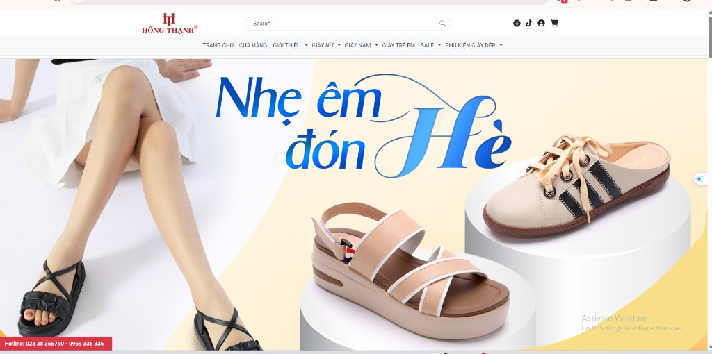
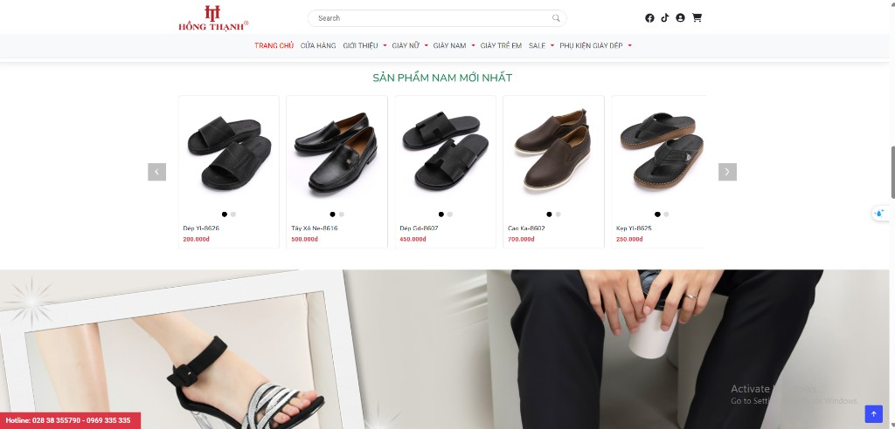

# ht-ecommerce-static

Multi-page storefront website for footwear and accessories. Content and navigation are primarily in Vietnamese. The site reuses shared **header** and **footer** fragments loaded at runtime, and ships with optional **PHP** endpoints for contact and newsletter forms.

---

## Introduction

### Homepage

The **homepage** (`index.html`) is one long scroll: the same header and hotline appear as you move through the hero, product carousels, and promotional blocks. The screenshots below show two parts of that same page.

**Hero (top of page)** — branding, search, utilities, and main nav; seasonal hero (**“Nhẹ êm đón Hè”**) with featured shoes and lifestyle imagery.



Across the top, **Hồng Thạnh** (HT) uses the logo on the left, a rounded **search** bar in the center, and icons for Facebook, TikTok, account, and **cart**. The menu is in Vietnamese (**TRANG CHỦ**, **CỬA HÀNG**, **GIỚI THIỆU**, **GIÀY NỮ** / **NAM** / **TRẺ EM**, **SALE**, **PHỤ KIỆN GIÀY DÉP**), with the active item highlighted. Below that, the hero spotlights summer comfort copy and product photography on a light layout.

**Further down the homepage** — category product rails (example: **“SẢN PHẨM NAM MỚI NHẤT”** / latest men’s products) with a horizontal carousel: shoe cards, names, prices in **đ** (Vietnamese đồng), prev/next controls, and dots for slides. A wide **promotional banner** pairs product close-ups with lifestyle imagery; the **hotline** bar stays visible, along with **scroll-to-top** and a floating **chat** entry point.



- **What it is:** A static HTML/CSS/JavaScript front end built on the [BootstrapMade Bikin](https://bootstrapmade.com/bikin-free-simple-landing-page-template/) template (Bootstrap **5.3.3**), customized for a shoe shop (menus for men’s/women’s/kids’ shoes, sales, accessories, store locator, blog-style pages).
- **Main entry:** Open `index.html` in a browser **via a local HTTP server** (see [Tutorial](#tutorial)) so `fetch()` can load `partials/header.html` and `partials/footer.html`.
- **Key pages (examples):**
  - `index.html` — home
  - `cuahang.html` — store listing
  - `introduce.html`, `log.html` — about / articles
  - `giayNam.html`, `giayNu.html`, `giayTreEm.html`, `giaySales.html`, `phuKien.html` — product category pages
  - `search.html` — product search results (`?q=…`)

---

## Tech stack (detail)

### Core

| Layer | Technology | Notes |
|--------|------------|--------|
| **Markup** | HTML5 | Multiple `.html` pages; no SPA framework. |
| **Styling** | CSS3, **Bootstrap 5.3.3** | Grid, utilities, components, RTL variants present under `assets/vendor/bootstrap/`. |
| **Icons** | **Bootstrap Icons**, **Font Awesome 6** (CDN in pages) | Mix of `bi-*` and Font Awesome classes. |
| **Typography** | **Google Fonts** | Roboto, Lato, Nunito (linked from `fonts.googleapis.com`). |
| **Scripting** | **Vanilla JavaScript** | `assets/js/main.js` (template behaviors), `header.js`, `cuahang.js`, inline scripts on some pages. |
| **Partials** | `includes.js` + `fetch()` | `HTShop.loadHeader()` / `loadFooter()` load `partials/*.html`; **requires HTTP(S)** (not reliable with `file://`). |
| **Search** | `site-search.js` + `products.json` | Client-side catalog filter; results on `search.html` (no backend). |

### Third-party libraries (vendored under `assets/vendor/`)

| Library | Role |
|---------|------|
| **Bootstrap** (`bootstrap.bundle.min.js`) | JS for dropdowns, modals, carousel, collapse, etc. |
| **AOS** | Animate-on-scroll for sections. |
| **Swiper** | Touch-friendly sliders/carousels. |
| **GLightbox** | Image/media lightbox. |
| **Isotope** + **imagesLoaded** | Filterable/masonry-style layouts after images load. |
| **php-email-form** (`validate.js`) | Client-side validation wired to PHP form endpoints. |

### Optional backend

| Piece | Role |
|--------|------|
| **PHP** | `forms/contact.php`, `forms/newsletter.php` process POST data and send mail via the **PHP Email Form** helper expected at `assets/vendor/php-email-form/php-email-form.php` (BootstrapMade pro asset; see comments inside the PHP files). |

### Source assets

| Path | Purpose |
|------|---------|
| `assets/css/` | Compiled/custom styles (`main.css`, page-specific CSS). |
| `assets/scss/` | SCSS sources / readme for theme customization (if you compile SCSS locally). |
| `assets/data/` | `products.json` — searchable product catalog for the header search. |

### What this project does **not** include

- No **Node.js** / **npm** / **Vite** / **Webpack** manifest in the repo (no `package.json`).
- No **React**, **Vue**, **Angular**, or similar SPA framework.
- No server-side rendering framework; pages are plain HTML unless you add your own stack.

---

## Tutorial

### 1. Run the site locally (recommended)

Because the header and footer are loaded with `fetch('partials/...')`, you should serve the project root over **HTTP**.

**Option A — PHP built-in server** (good if you also want to test forms):

```bash
cd path/to/HT_Shop
php -S localhost:8080
```

Then open `http://localhost:8080/index.html` in your browser.

**Option B — Any static file server** (header/footer only; forms will not work without PHP):

Examples: `npx serve .`, Python `python -m http.server 8080`, or IIS/XAMPP pointing at this folder.

### 2. Edit global layout (header / footer)

1. Open `partials/header.html` for navigation, logo, and top bar.
2. Open `partials/footer.html` for the site footer.
3. Reload any page that includes the `fetch` scripts; changes apply to all pages that load those partials.

**Note:** Some links in the header use absolute paths like `/index.html`. On a local server, ensure the site is served from the **root** of that server (or adjust links to relative paths such as `index.html` if you deploy in a subfolder).

### Product search (client-side)

- The header search box loads `assets/js/site-search.js` and reads the catalog **`assets/data/products.json`** (no server database).
- While typing, a short suggestion list appears; **Enter** or the search icon opens **`search.html?q=…`** with a full grid of matches.
- Matching is case-insensitive and strips most combining accents so queries like `dep` can match **Dép**.
- To add or change products, edit **`assets/data/products.json`** (fields: `name`, `price`, `image`, `category`, `categoryUrl`, optional `keywords`, optional `detailUrl`; default detail link is `portfolio-details.html`).

### HTML page organization

- **Shop pages** (`index.html`, `search.html`, `introduce.html`, `log.html`, `cuahang.html`, `giay*.html`, `phuKien.html`) share one layout rhythm:
  1. `<head>` — meta → favicons → fonts → Font Awesome → vendor CSS → `main.css` (+ page CSS) → **`assets/js/includes.js`**
  2. **Site header** — empty `<header id="header">` then `<script>HTShop.loadHeader();</script>` (loads `partials/header.html`)
  3. **Page body** — content only, introduced with `<!-- ========== Page: … ========== -->`
  4. **Optional** — `<div id="layoutCommon">` + `HTShop.loadLayoutCommon()` for `partials/commonNamNu.html` (store + category listing pages)
  5. **Site footer** — `<footer id="footer">` then `HTShop.loadFooter();`
  6. **Scripts** — vendor bundle → `header.js` → `site-search.js` → `main.js` (and any page-specific script before that block when needed)
- **Legacy/template-only pages** (`starter-page.html`, `portfolio-details.html`, `service-details.html`) still use the old embedded header pattern from the BootstrapMade template; new storefront pages should copy a refactored shop page instead.

### 3. Add or change a page

1. Copy a refactored shop page (**`introduce.html`**, **`giayNam.html`**, or **`search.html`**) instead of `starter-page.html` if you need the shared header, footer, and search.
2. Keep the same `<head>` vendor CSS order as other pages for consistent styling.
3. Include the same vendor JS at the bottom (`bootstrap.bundle`, `main.js`, etc.) as `index.html` unless you know you can omit a library.
4. Keep **`assets/js/includes.js`** in `<head>` and call **`HTShop.loadHeader()`** / **`HTShop.loadFooter()`** after the placeholders; include **`assets/js/site-search.js`** immediately after **`header.js`** when the search box is present.

### 4. Styling

- Global rules: `assets/css/main.css`.
- Page-specific: e.g. `assets/css/cuahang.css`, `assets/css/log.css`.
- If you maintain SCSS, compile into `assets/css/` and keep class names aligned with Bootstrap where possible.

### 5. Contact and newsletter forms

1. Ensure **PHP** is enabled on your host.
2. In `forms/contact.php` (and similarly `forms/newsletter.php`), set `$receiving_email_address` to your real inbox.
3. Add `assets/vendor/php-email-form/php-email-form.php` if you use BootstrapMade’s PHP Email Form library, or replace the scripts with your own mail/API logic.
4. For **SMTP**, uncomment and fill the `$contact->smtp` block in the PHP file as documented there.

### 6. Deploy

Upload the full folder structure to a host that supports **static files** and, if needed, **PHP**. Preserve paths so `assets/` and `partials/` resolve correctly from the web root.

---

## Repository layout (overview)

```
HT_Shop/
├── index.html, search.html   # Home + search results
├── cuahang.html              # Stores
├── introduce.html, log.html
├── giay*.html, phuKien.html
├── partials/                 # header.html, footer.html, shared snippets
├── forms/                    # contact.php, newsletter.php
├── assets/
│   ├── data/products.json    # Search catalog (client-side)
│   ├── css/
│   ├── js/                   # includes.js, header.js, site-search.js, main.js, …
│   ├── img/
│   ├── scss/
│   └── vendor/               # Bootstrap, Swiper, AOS, etc.
└── README.md
```

---

## License and third-party credits

- Template basis: **Bikin** by BootstrapMade (see header comments in `assets/js/main.js` and [BootstrapMade license](https://bootstrapmade.com/license/)).
- Vendor libraries retain their respective licenses under `assets/vendor/`.

If you want this README to include deployment steps for a specific host (cPanel, Azure, Netlify with PHP, etc.), say which environment you use and we can add a short section for it.
